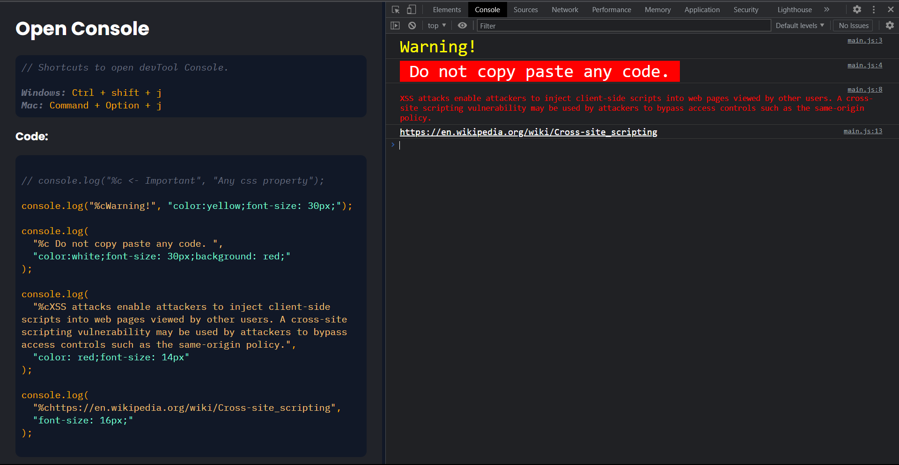
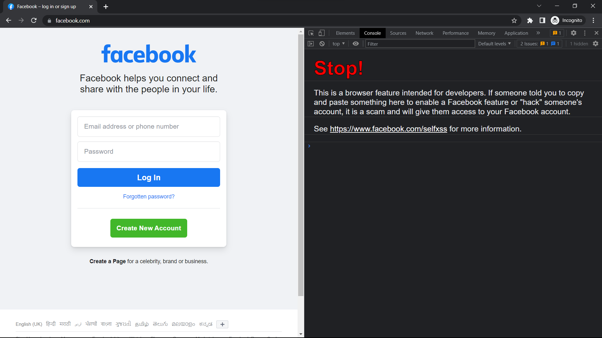

# Open Console

**_Shortcuts to open devTool Console._**

```
Windows: Ctrl + shift + j
Mac: Command + Option + j
```

## Code:

```javascript
// console.log("%c <- Important", "Any css property");

console.log("%cWarning!", "color:yellow;font-size: 30px;");
console.log(
  "%c Do not copy paste any code. ",
  "color:white;font-size: 30px;background: red;"
);
console.log(
  "%cXSS attacks enable attackers to inject client-side scripts into web pages viewed by other users. A cross-site scripting vulnerability may be used by attackers to bypass access controls such as the same-origin policy.",
  "color: red;font-size: 14px"
);
console.log(
  "%chttps://en.wikipedia.org/wiki/Cross-site_scripting",
  "font-size: 16px;"
);
```

## Screenshot



### From Facebook


